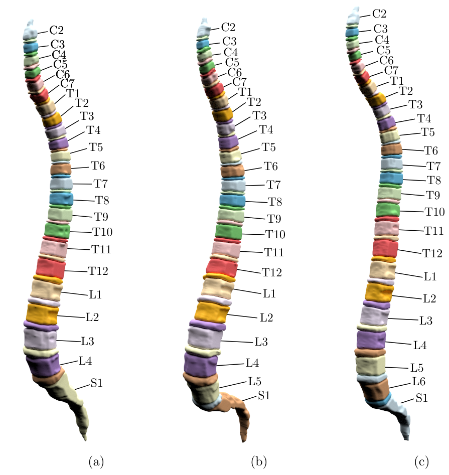
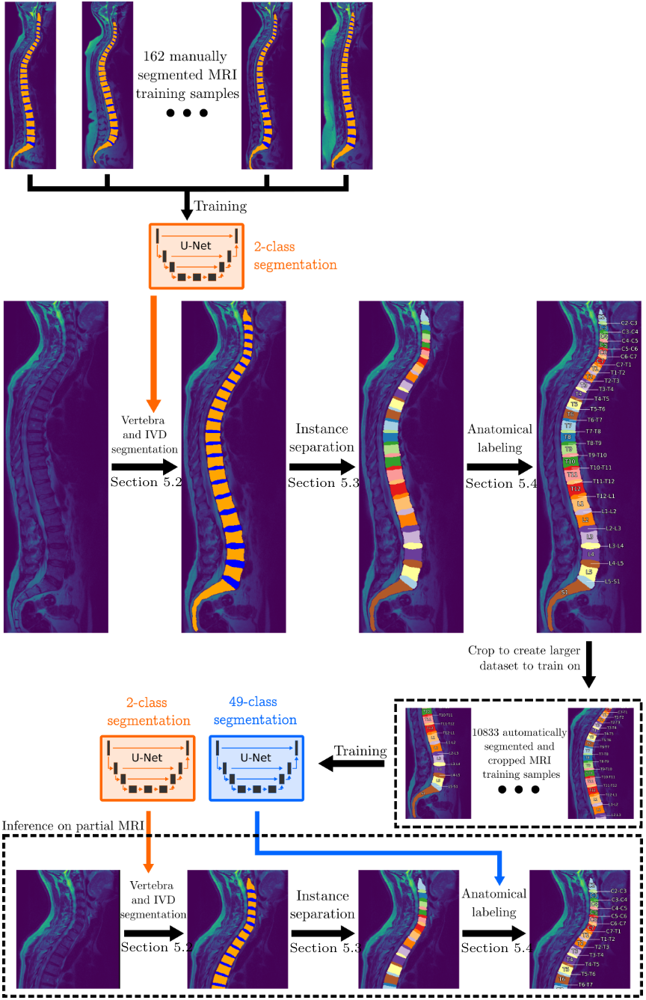

<h1 align="center">Spine</h1>

A python library including pretrained models in order to annotate vertebrae and IVDs (intevertebral discs) on small FOV (field-of-view) MRIs. This was created as part of my [master's thesis](https://brutenis.net/master-thesis) which was submitted on 9 November 2023.

## Showcase

Below three spines can be seen which were automatically segmented from MRI images using this library. **(a)** shows sacralization (lack of lumbar vertebra L5), **(c)** shows lumbarization (additional vertebra L6). **(b)** shows a normal spine.




## Workflow

Initially, 162 samples annotated by experts are utilized to train a preliminary segmentation model.
This model is then employed to segment an extensive dataset of 10,833 MRI scans.
The segmented data is separated into vertebrae and IVDs, leveraging the fact that all instances can be inferred in a complete MRI scan by assuming the topmost vertebra is C2.
By cropping images from the large dataset, a substantial training set is generated.
This set is used to train an anatomical labeling segmentation model specifically for small FOV MRI images.



## Installation

```sh
poetry install
```
